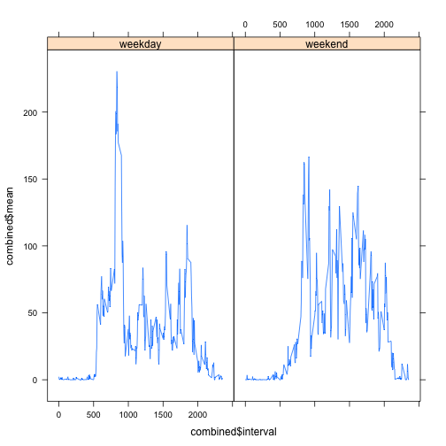

```r
library(data.table)
library(knitr)
library(markdown)
library(lattice)
library(plyr)
```

## Loading and preprocessing the data

We want to get rid of any observations that contain an NA value. We also want to split up the data frame
into separate data frames using the date variable Each data frame will consist of observations from a specific day in the data set.


```r
data <- read.csv("activity.csv")
final <- na.omit(data)
splitData <- split(final , f = final$date)
```

## What is mean total number of steps taken per day?

At this point we need to convert the data frame into a data table, and then run an lapply with the native sum function on a subset, so as to get the sum of steps across the already split data. 

The actual question answered does not specify anything more than showing a histogram of the total steps for each day, which is what is done here.

Finally, we run the native mean and median functions on the entire steps column.


```r
DT <- data.table(final)

tableSteps <- DT[, lapply(.SD, sum), by = date]

hist(tableSteps$steps)
```

 

```r
mean(tableSteps$steps)
```

```
## [1] 10766.19
```

```r
median(tableSteps$steps)
```

```
## [1] 10765
```

## What is the average daily activity pattern?

This code is very similar to the code above, in that we simply create a data table, and run the lapply on a subset but use the interval instead of the date and get the average instead of the sum.


```r
DT <- data.table(final)

tableInterval <- DT[, lapply(.SD, mean), by = interval]

plot(tableInterval$interval, tableInterval$steps, type="l")
```

 

The interval with the maximum number of steps is:


```r
print(tableInterval[tableInterval$steps == max(tableInterval$steps),]$interval)
```

```
## [1] 835
```

The mean number of steps for that interval is:


```r
print(tableInterval[tableInterval$steps == max(tableInterval$steps),]$steps)
```

```
## [1] 206.1698
```

## Imputing missing values

We can easily find the number of NA values in the data set by running the sum function on the steps column, which itself is wrapped in a is.na function. 


```r
sum(is.na(data$steps))
```

```
## [1] 2304
```

A suitable strategy for filling in the missing data for the steps variable is to find the mean of steps made during that day and interval.

The following code updates the existing data, data frame and replaces null values with the mean of steps for that particular interval. The replacement values come from the previous tableInterval data set.

When running the histogram function we find that the frequency necessarily increases for all sum steps. However, the mean and median are more or less, the same.


```r
for (i in 1:nrow(data)) {
         if (is.na(data[i,1])) {
                data[i,1] <- tableInterval[tableInterval$interval == data[i,3],]$steps
        }
}

imputedDataTable <- data.table(data)

imputedData <- imputedDataTable[, lapply(.SD, sum), by = date]

hist(imputedData$steps)
```

 

```r
mean(imputedData$steps)
```

```
## [1] 10766.19
```

```r
median(imputedData$steps)
```

```
## [1] 10766.19
```

## Are there differences in activity patterns between weekdays and weekends?

In the following code, we convert the table to include a new column, dayType, which contains either "weekday" or "weekend". We also convert the date column to POSIXct data type. Finally, we do a check using the weekdays() function too see if the date corresponds to a weekday, or weekend, and subsequently store an indication of such in the newly created column. Finally, we convert the dayType column to a factor variable.


```r
imputedDataTable$dayType <- ""
imputedDataTable$date <- as.POSIXct(strptime(imputedDataTable$date,format="%Y-%m-%d"))

for (i in 1:nrow(imputedDataTable)) {
        if (weekdays.POSIXt(imputedDataTable[i,]$date) == "Saturday" || weekdays.POSIXt(imputedDataTable[i,]$date) == "Sunday") {
                imputedDataTable[i,4] <- "weekend"
} else {
                imputedDataTable[i,4] <- "weekday"
        }
}

imputedDataTable$dayType <- as.factor(imputedDataTable$dayType)
```

For the last excercise, we create a two panel line plot using the weekday and weekend factors and the lattice plotting system.


```r
split <- split(imputedDataTable , f = imputedDataTable$dayType)

subsettedWeekday <- ddply(
                split$weekday, 
                .(interval), 
                summarize, 
                mean = round(mean(steps), 2)
        )

subsettedWeekend <- ddply(
                split$weekend, 
                .(interval), 
                summarize, 
                mean = round(mean(steps), 2)
        )

subsettedWeekday$dayType <- "weekday"
subsettedWeekend$dayType <- "weekend"

combined <- rbind(subsettedWeekday, subsettedWeekend)

xyplot(combined$mean~combined$interval|factor(combined$dayType), type="l")
```

 
